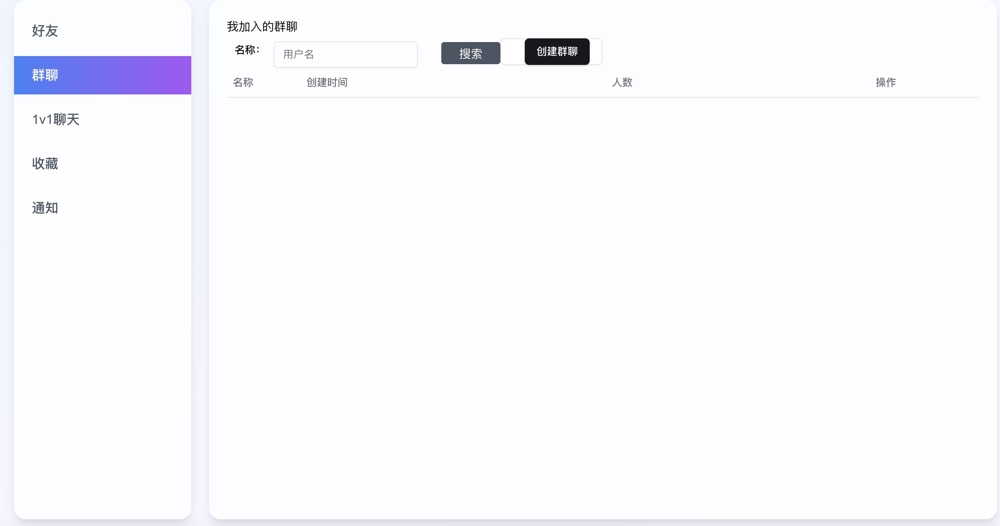

这是一个使用前端 nextjs(book-client)，后端 nestjs(nest-book-server)写的聊天项目；
有完整的用户验证，redis 验证码缓存，pgsql 用户信息储存；
功能：用户登录，好友添加，一对一聊天，群聊，文字，表情包，一对一视频；
待开发：直播间，文件上传等

1.打开终端并切换到项目目录
cd /path/to/chatproject //导航到你自己的临时目录 2. 生成私钥
运行以下命令生成一个 2048 位的 RSA 私钥文件 privatekey.pem：
openssl genpkey -algorithm RSA -out privatekey.pem -pkeyopt rsa_keygen_bits:2048 3. 生成证书签名请求（CSR）
运行以下命令生成一个证书签名请求（CSR）文件 csr.pem：
openssl req -new -key privatekey.pem -out csr.pem -subj "/C=CN/ST=Beijing/L=Beijing/O=MyOrg/OU=MyUnit/CN=example.com"
-subj 参数用于指定证书的主题信息，你可以根据需要修改这些值。 4. 生成自签名证书
运行以下命令生成一个有效期为 365 天的自签名证书文件 certificate.pem：
openssl x509 -req -days 365 -in csr.pem -signkey privatekey.pem -out certificate.pem

配置 Coturn 使用生成的证书和私钥
在 Coturn 的配置文件中，指定生成的证书和私钥文件路径：
cert=/path/to/chatproject/certificate.pem
pkey=/path/to/chatproject/privatekey.pem
将 /path/to/chatproject/ 替换为你的实际项目路径。

注意事项
安全性：虽然将证书和私钥放在项目目录中方便管理，但要确保这些文件的安全性。例如，不要将私钥文件上传到公共代码仓库（如 GitHub）。
备份：生成的私钥和证书文件非常重要，建议将它们备份到安全的地方

docker 启动 coturn 命令：
docker run -d --name coturn-server \  
 -p 3478:3478/udp \
 -p 3478:3478/tcp \
 -p 5349:5349/tcp \
 -v "$(pwd)/turnserver.conf":/etc/turnserver/turnserver.conf \
  -v "$(pwd)/certificate.pem":/etc/turnserver/certificate.pem \
 -v "$(pwd)/privatekey.pem":/etc/turnserver/privatekey.pem \
 coturn/coturn:latest \
 -c /etc/turnserver/turnserver.conf \
 --realm 172.20.10.10 \
 --no-stdout-log=false

